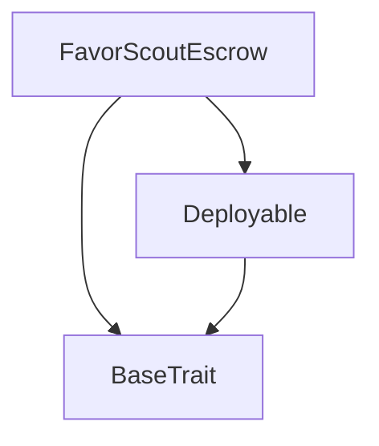

# Tact compilation report
Contract: FavorScoutEscrow
BoC Size: 2632 bytes

## Structures (Structs and Messages)
Total structures: 15

### DataSize
TL-B: `_ cells:int257 bits:int257 refs:int257 = DataSize`
Signature: `DataSize{cells:int257,bits:int257,refs:int257}`

### SignedBundle
TL-B: `_ signature:fixed_bytes64 signedData:remainder<slice> = SignedBundle`
Signature: `SignedBundle{signature:fixed_bytes64,signedData:remainder<slice>}`

### StateInit
TL-B: `_ code:^cell data:^cell = StateInit`
Signature: `StateInit{code:^cell,data:^cell}`

### Context
TL-B: `_ bounceable:bool sender:address value:int257 raw:^slice = Context`
Signature: `Context{bounceable:bool,sender:address,value:int257,raw:^slice}`

### SendParameters
TL-B: `_ mode:int257 body:Maybe ^cell code:Maybe ^cell data:Maybe ^cell value:int257 to:address bounce:bool = SendParameters`
Signature: `SendParameters{mode:int257,body:Maybe ^cell,code:Maybe ^cell,data:Maybe ^cell,value:int257,to:address,bounce:bool}`

### MessageParameters
TL-B: `_ mode:int257 body:Maybe ^cell value:int257 to:address bounce:bool = MessageParameters`
Signature: `MessageParameters{mode:int257,body:Maybe ^cell,value:int257,to:address,bounce:bool}`

### DeployParameters
TL-B: `_ mode:int257 body:Maybe ^cell value:int257 bounce:bool init:StateInit{code:^cell,data:^cell} = DeployParameters`
Signature: `DeployParameters{mode:int257,body:Maybe ^cell,value:int257,bounce:bool,init:StateInit{code:^cell,data:^cell}}`

### StdAddress
TL-B: `_ workchain:int8 address:uint256 = StdAddress`
Signature: `StdAddress{workchain:int8,address:uint256}`

### VarAddress
TL-B: `_ workchain:int32 address:^slice = VarAddress`
Signature: `VarAddress{workchain:int32,address:^slice}`

### BasechainAddress
TL-B: `_ hash:Maybe int257 = BasechainAddress`
Signature: `BasechainAddress{hash:Maybe int257}`

### Deploy
TL-B: `deploy#946a98b6 queryId:uint64 = Deploy`
Signature: `Deploy{queryId:uint64}`

### DeployOk
TL-B: `deploy_ok#aff90f57 queryId:uint64 = DeployOk`
Signature: `DeployOk{queryId:uint64}`

### FactoryDeploy
TL-B: `factory_deploy#6d0ff13b queryId:uint64 cashback:address = FactoryDeploy`
Signature: `FactoryDeploy{queryId:uint64,cashback:address}`

### ResolveScoutDispute
TL-B: `resolve_scout_dispute#1adf8187 freelancerPercent:uint8 = ResolveScoutDispute`
Signature: `ResolveScoutDispute{freelancerPercent:uint8}`

### FavorScoutEscrow$Data
TL-B: `_ platform:address customer:address freelancer:address scout:address dealId:uint64 scoutCommissionSharePercent:uint8 deadlineDurationSeconds:uint32 amount:coins status:uint8 deadlineAt:uint64 = FavorScoutEscrow`
Signature: `FavorScoutEscrow{platform:address,customer:address,freelancer:address,scout:address,dealId:uint64,scoutCommissionSharePercent:uint8,deadlineDurationSeconds:uint32,amount:coins,status:uint8,deadlineAt:uint64}`

## Get methods
Total get methods: 5

## status
No arguments

## deadlineAt
No arguments

## details
No arguments

## scoutAddress
No arguments

## scoutSharePercent
No arguments

## Exit codes
* 2: Stack underflow
* 3: Stack overflow
* 4: Integer overflow
* 5: Integer out of expected range
* 6: Invalid opcode
* 7: Type check error
* 8: Cell overflow
* 9: Cell underflow
* 10: Dictionary error
* 11: 'Unknown' error
* 12: Fatal error
* 13: Out of gas error
* 14: Virtualization error
* 32: Action list is invalid
* 33: Action list is too long
* 34: Action is invalid or not supported
* 35: Invalid source address in outbound message
* 36: Invalid destination address in outbound message
* 37: Not enough Toncoin
* 38: Not enough extra currencies
* 39: Outbound message does not fit into a cell after rewriting
* 40: Cannot process a message
* 41: Library reference is null
* 42: Library change action error
* 43: Exceeded maximum number of cells in the library or the maximum depth of the Merkle tree
* 50: Account state size exceeded limits
* 128: Null reference exception
* 129: Invalid serialization prefix
* 130: Invalid incoming message
* 131: Constraints error
* 132: Access denied
* 133: Contract stopped
* 134: Invalid argument
* 135: Code of a contract was not found
* 136: Invalid standard address
* 138: Not a basechain address
* 6722: Percentage must be between 0 and 100
* 14598: Deadline reached
* 21835: Only customer can deposit
* 23964: Expected amount must be positive
* 32780: Can only dispute active agreements
* 33459: Invalid escrow status
* 35739: Already deposited
* 36057: Deposit is below expected amount plus reserve
* 42435: Not authorized
* 45284: Agreement must be disputed
* 45995: Customer deadline refund requires an active escrow
* 48201: Deadline not reached
* 57229: Only platform can resolve disputes
* 57669: Only participants can dispute
* 59014: Deadline duration must be positive

## Trait inheritance diagram

## Contract dependency diagram

